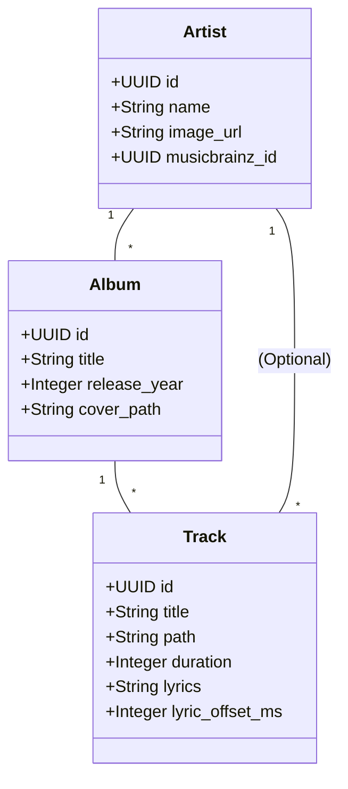

# Papilio 领域模型 (Domain Model)

## 1. 核心实体 (Core Entities)

## 2. 媒体扫描流 (Media Scanning Pipeline)

系统采用“工业级”双阶段扫描策略：

1.  **物理扫描 (Physical Scan)**:
    - 遍历 `MUSIC_DIR` 下的所有音频文件。
    - 提取嵌入的 ID3/Vorbis 标签。
    - 建立磁盘路径与数据库 ID 的唯一映射 (`path` UNIQUE)。
    - **自愈机制**: 自动清理数据库中指向已删除物理文件的孤立记录。

2.  **元数据补全 (Metadata Enrichment)**:
    - 异步对接 MusicBrainz / Wikidata 接口。
    - 自动抓取高清封面并持久化至本地磁盘。
    - 自动嗅探本地 `.lrc` 文件，支持 UTF-8/GBK 编码自动转换。

## 3. 播放列表与权限 (Access Control)

- **RBAC 模型**:
    - **普通用户**: 仅能操作自己的播放列表和收藏。
    - **管理员**: 拥有全局扫描权限、系统配置修改权限及全量会话控制 (Kick User)。
- **物理安全**: 头像上传经过 Magic Number 指纹校验，严格物理隔离。

## 4. 实时流媒体规格 (Streaming Spec)

- **无损透传**: 默认支持 Range Request (206 Partial Content)，兼容原生无损流。
- **动态转码**: 支持通过 `bitrate` 参数触发 FFmpeg 实时转码为 MP3 流，适应移动端弱网环境。
