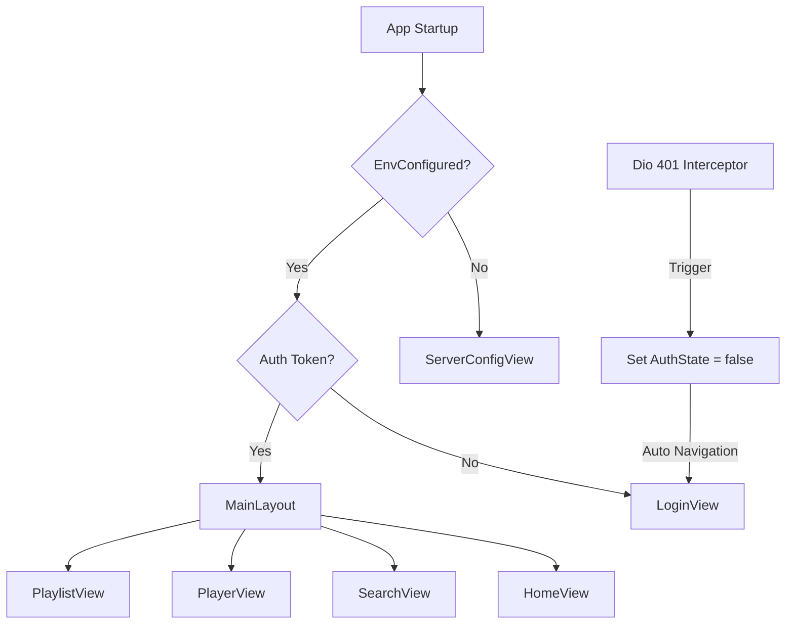

# Papilio 移动端架构规格 (Mobile Architecture)

## 1. 核心技术栈
- **框架**: Flutter 3.16+
- **状态管理**: Riverpod 2.x (使用 `@riverpod` 注解及代码生成)
- **网络**: Dio (配合全局拦截器)
- **音频**: just_audio + audio_service (前台服务集成)

## 2. 状态流转图 (State Management)

系统状态的核心由 `authStateProvider` 驱动，它决定了应用的根视图：

## 3. 目录结构规范
- `lib/src/api/`: REST API 客户端与仓储逻辑。
- `lib/src/providers/`: 全局业务状态（Player, Download, Sync）。
- `lib/src/ui/`: 视图层，遵循原子化拆分。
- `lib/src/models/`: 数据模型，使用 `json_serializable` 实现。

## 4. 鉴权守卫 (Auth Gate)
`AuthGate` 监听 `authStateProvider`。当 Token 被拦截器标记为失效或用户手动登出时，UI 层会利用 Flutter 的声明式导航自动切回登录页面，无需手动调用跳转。
